# THE NOODLES

「stir fly eighteen」をオマージュしたラーメンカードゲームです。  
印刷カードでの対面プレイに加え、ブラウザでも 1〜4 人で遊べます。

**プレイ**: https://python-yarouze.github.io/the-noodles/

本リポジトリは本家のルール・世界観に敬意を払ったファン作品です。本家の権利を侵害する意図はありません。ルールの基本骨格は stir fly eighteen を参考にしつつ、★カードや味見まわりなどオリジナル要素を足した **THE NOODLES** ルールと、★なしに寄せた **本家ルール（classic）** を選べます。

---

## 遊び方（ロビー）

| モード | 手順 |
|--------|------|
| **オンライン（2〜4人）** | 「部屋を作る」→ 部屋コードを共有 → 相手が「部屋に参加」→ ホストが「はじめる」 |
| **1人（vs CPU）** | 対戦設定の人数を選ぶ →「1人でプレイ」 |

### 対戦設定

- **ルールセット**: THE NOODLES（★あり）／本家ルール（★なし）
- **目標ポイント**: デフォルト 50（先取）
- **味見の制限時間**: デフォルト 15 秒（`0` で制限なし）
- **人数**: 2〜4（オンライン・ソロ共通。空きは開始時に CPU）

ホストのブラウザが進行を管理します（タブを閉じると部屋は終了します）。

---

## ゲームの目的

手番でカードを集め・料理して得点し、**先に目標点**（既定 50 点）に達した人が勝ちです。

開始時、各自 **手札 3 枚**。手番終了時も手札は **最大 3 枚**（多い分は捨てます）。

---

## 1 手番の流れ（フェイズ）

手番は次のフェイズを順に進みます。ゲーム内の表示名と対応させてあります。

```text
【ドロー】→【伏せ引き】⇄【味見】→【料理】→【料理の確認】→【手札調整】→ 次の人の【ドロー】
```

「伏せ引き」は最大 2 回（1 枚宣言と 2 枚ペアを各 1 回）まで使え、そのたびに「味見」を挟みます。使い切るかスキップすると「料理」へ進みます。

### 1. ドロー

- 手番開始時に、山札から **通常 1 枚** 自動で引きます（操作不要）。
- 本家ルールで味見に成功した人は、次の自分の手番で **+1 枚** 余分に引くことがあります。
- 山が尽きたら捨て札を切り直して山に戻します。

→ すぐに **伏せ引き** へ。

### 2. 伏せ引き（任意）

手番プレイヤーが、手札を**伏せて捨て、山から引き直す**フェイズです。やらなくてもかまいません（「スキップ」で料理へ）。

| 種類 | 内容 | 成功時のドロー |
|------|------|----------------|
| **1 枚宣言** | 手札 1 枚を伏せ、「とり／ぶた／えび」のいずれかを宣言 | とり 2 枚／ぶた 3 枚／えび 4 枚 |
| **2 枚ペア** | 手札 2 枚を伏せて「ペア」と宣言 | 3 枚 |

- 1 枚宣言は **ブラフ可**（伏せたカードと宣言が違ってもよい）。相手に見破られると不利です。
- 2 枚ペアも「同名 2 枚」以外の正当な組み合わせがあります（後述）。正当なら味見されても嘘ではありません。
- 各ターン、**1 枚宣言・2 枚ペアはそれぞれ 1 回まで**。

宣言すると → **味見** へ。スキップ、または 1 枚＋2 枚を使い切ると → **料理** へ。

### 3. 味見（相手の番）

伏せ引きの宣言に対し、**宣言者以外**が反応するフェイズです。

- **味見**: 伏せ札が正直か見る。**早い者勝ち（最初の 1 人だけ）**。
- **パス**: 個人単位。非宣言者の全員がパスするか、制限時間が切れると未味見のまま解決します。
- 味見できない条件: 手札 0 枚 **かつ** 得点が 4 点以下。

| 結果 | どうなるか |
|------|------------|
| **正直だった** | 味見した人は手札をすべて捨てる（手札が無い場合は −5 点）。宣言者は予定どおり山から引く。 |
| **嘘だった（THE NOODLES）** | 宣言者は引けない。味見した人が、宣言どおりの枚数を山から**すぐ**引く。 |
| **嘘だった（本家ルール）** | 宣言者は引けない。味見した人は**次の自分の手番で +1 ドロー**。 |

解決後、まだ伏せ引きが残っていれば **伏せ引き** に戻り、終わっていれば **料理** へ。

### 4. 料理（任意）

手札から **3〜5 枚** を選んでラーメンを完成させ、得点します。やらなくてもかまいません。

**成立条件**

- 枚数は 3〜5、**カード名はすべて違う**
- **必須食材がちょうど 1 つ**: 「めん」または「ごはん」（同時には出せない。ごはんはめん扱い）

料理すると使用カードは捨て札へ入り、得点が加算されます（このあと山から 1 枚引く場合あり）。  
→ **料理の確認** へ。スキップすると、手札が 4 枚以上なら **手札調整**、3 枚以下なら次の人の **ドロー**。

### 5. 料理の確認

全員が完成した料理を見て「確認」します（一定時間で自動進行）。  
ここで目標点に達していれば勝利が確定し、**終了**。達していなければ手札に応じて **手札調整** または次手番の **ドロー**。

### 6. 手札調整

手札が 4 枚以上なら、**3 枚になるまで**捨てます。  
→ 次のプレイヤーの **ドロー**。

---

## 得点のしくみ

料理に出した**各カードの点数を足し**、最後に **にんにく** があればその小計を **2 倍**します（にんにくの −2 も足してから倍）。  
カード単体の基本点より、「一緒に何を出したか」で点数が変わるのがポイントです。

### 合計点の計算例（画像つき）

たとえば次の 4 枚で料理したとします。

<p>
  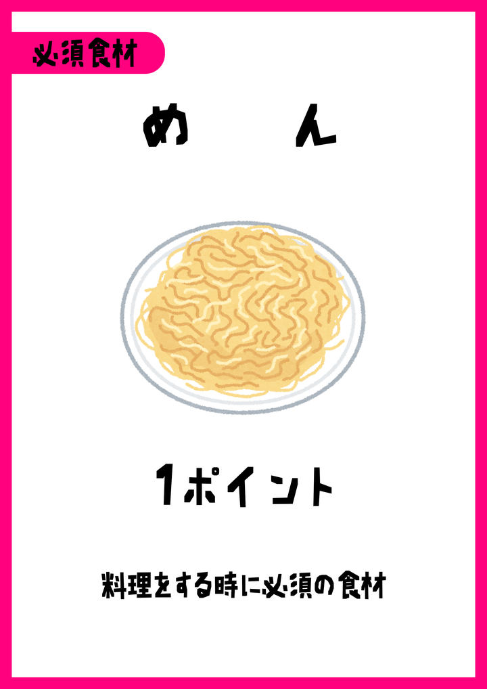
  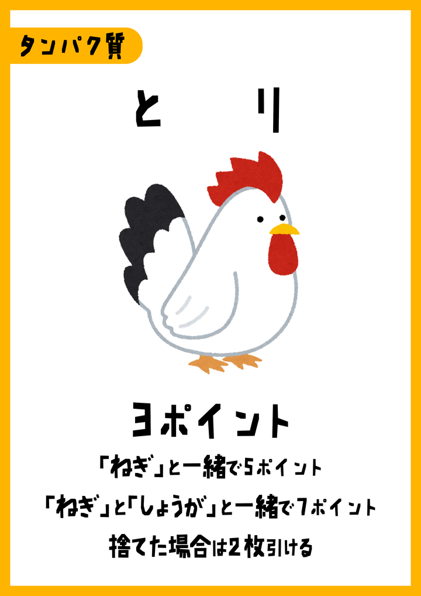
  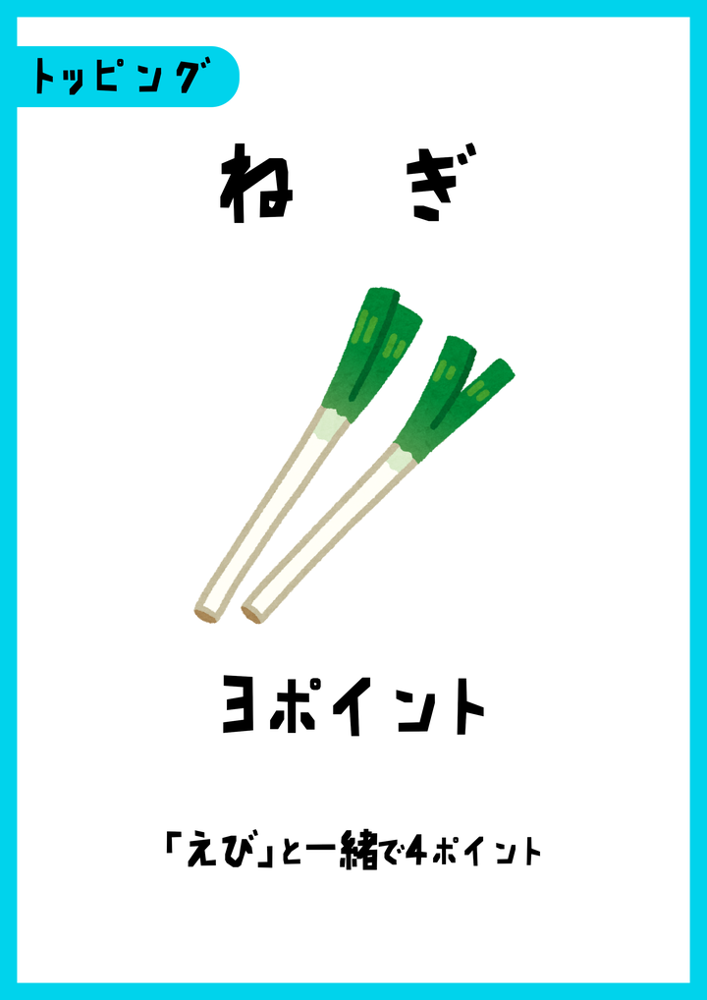
  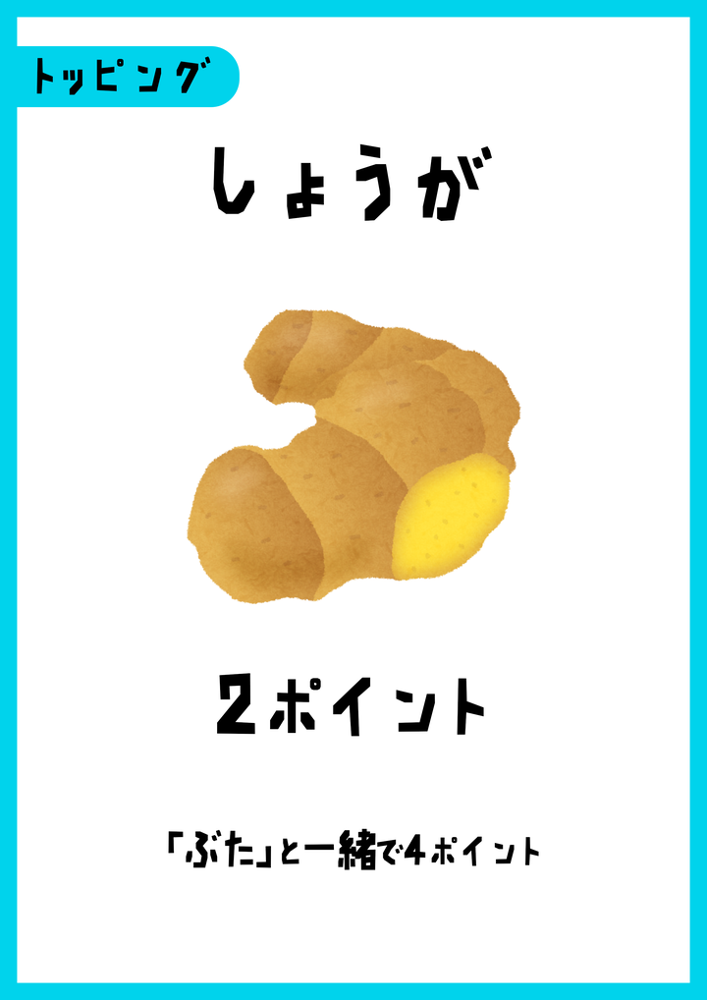
</p>

**めん ＋ とり ＋ ねぎ ＋ しょうが**

| カード | この料理での点数 | 理由 |
|--------|------------------|------|
| めん | **1** | 必須食材の基本 |
| とり | **7** | ねぎとしょうがが両方あるため（基本 3 → ねぎで 5 → ねぎ＋しょうがで 7） |
| ねぎ | **3** | えびが無いので基本のまま |
| しょうが | **2** | ぶたが無いので基本のまま |
| **合計** | **13 点** | 1 + 7 + 3 + 2 |

同じ「とり」でも、ねぎやしょうがが無いと 3 点のままです。相手の手札や場の状況を見ながら、コンボが揃う料理を狙うのがコツです。

#### にんにくがある場合

<p>
  
  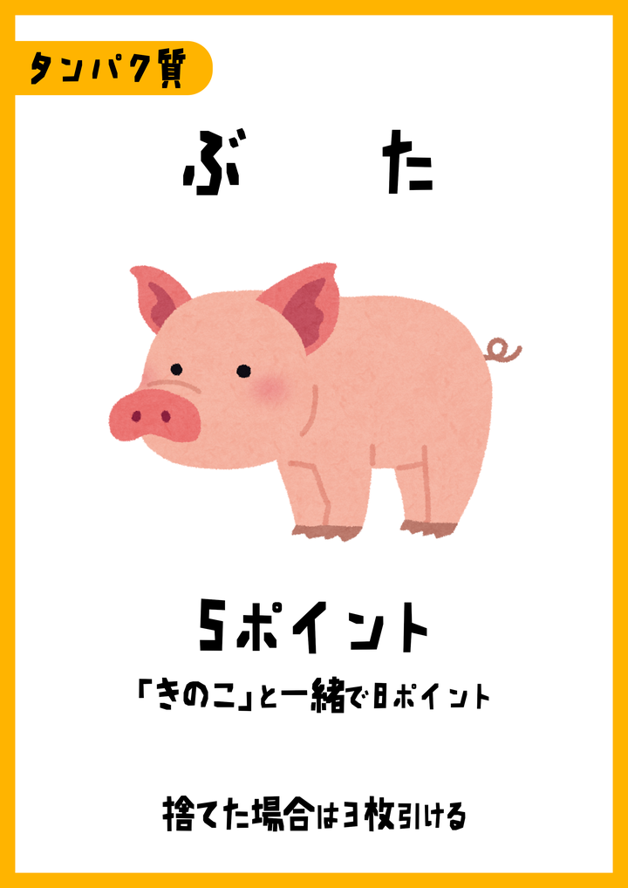
  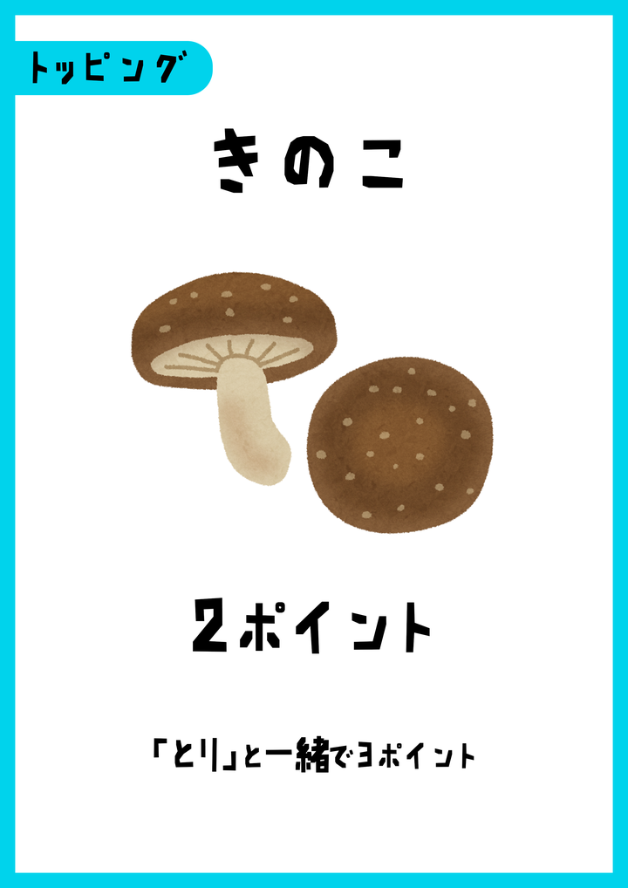
  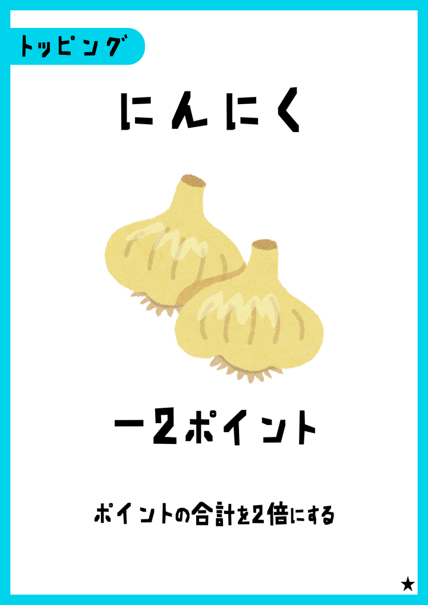
</p>

**めん ＋ ぶた ＋ きのこ ＋ にんにく**

| カード | この料理での点数 |
|--------|------------------|
| めん | 1 |
| ぶた | 8（きのこと一緒） |
| きのこ | 2 |
| にんにく | −2 |
| 小計 | 1 + 8 + 2 + (−2) = **9** |
| **にんにくで ×2** | **18 点** |

### 組み合わせで点数が変わる例（基本）

同じカードでも、一緒に出した食材で点数が上がります。

| 組み合わせのイメージ | 点数の変化 |
|----------------------|------------|
| とり ＋ **ねぎ** | とりが 5 点 |
| とり ＋ ねぎ ＋ **しょうが** | とりが 7 点 |
| **ぶた** ＋ **きのこ** | ぶたが 8 点 |
| **えび** ＋ **しょうが** ＋ **しょうゆ** | えびが 11 点 |
| **たまご** ＋ いずれかの調味料 | たまごが 5 点 |
| **しょうゆ** ＋ **ねぎ** | しょうゆが 2 点 |
| **しょうゆ** ＋ **しょうが** | しょうゆが 3 点 |

### 特殊な点数変動（特に注意）

| カード | 特殊ルール |
|--------|------------|
| 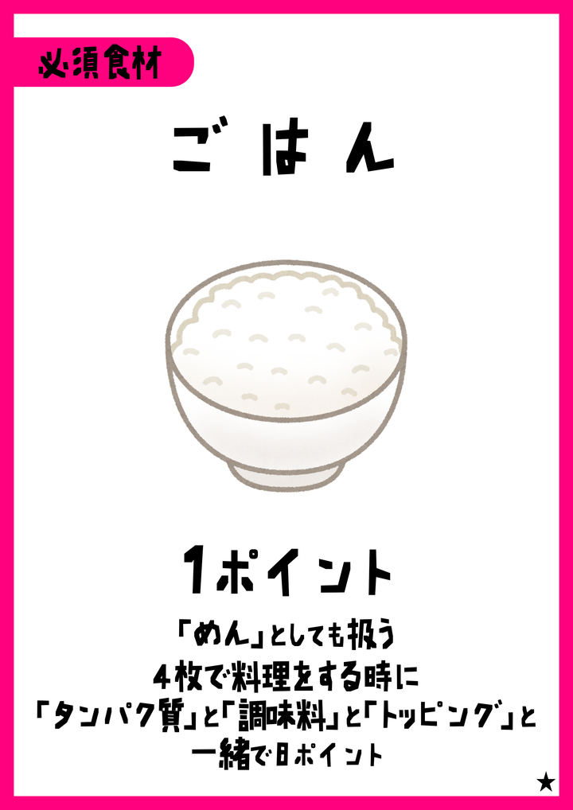 **ごはん** | ちょうど **4 枚**で「ごはん＋タンパク質＋調味料＋トッピング」なら、ごはんが **8 点** |
| 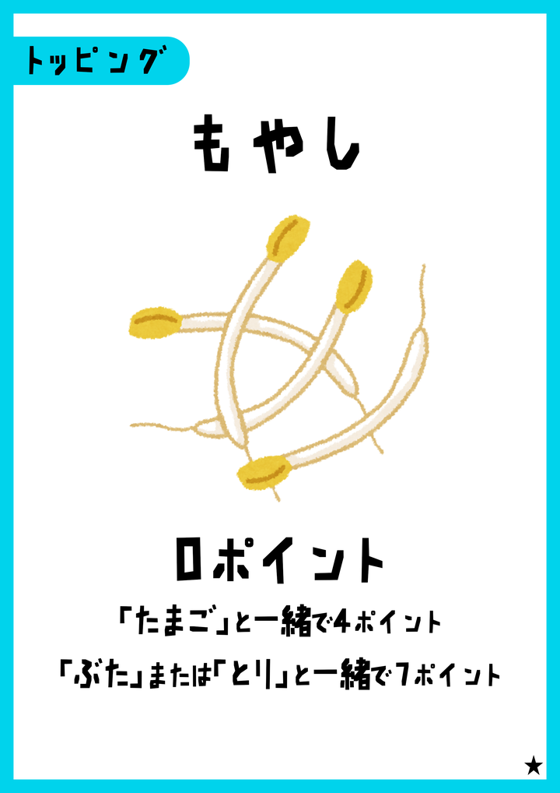 **もやし** | 基本 0。**たまご**とで 4 点、**ぶた**または**とり**とで **7 点** |
| 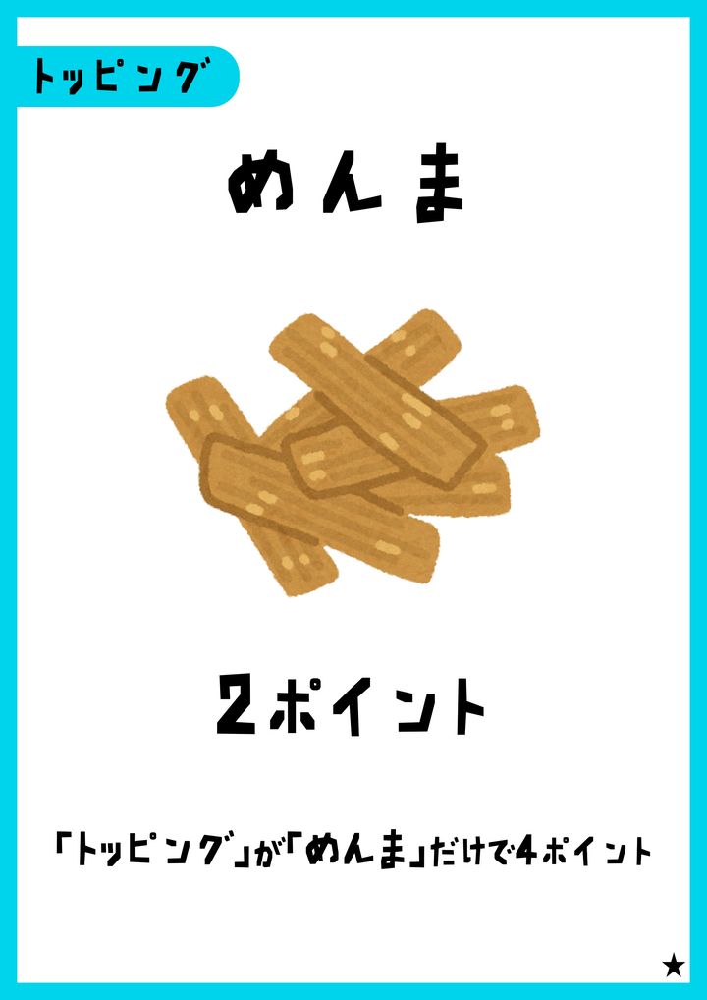 **めんま** | 基本 2。トッピングがめんま**だけ**なら **4 点** |
| 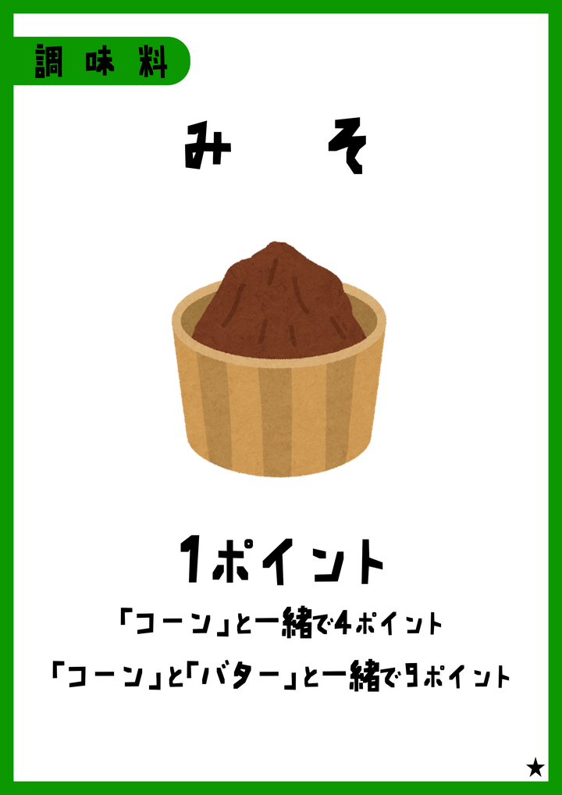 **みそ** | **コーン**で 4 点、コーン＋**バター**で **9 点** |
| 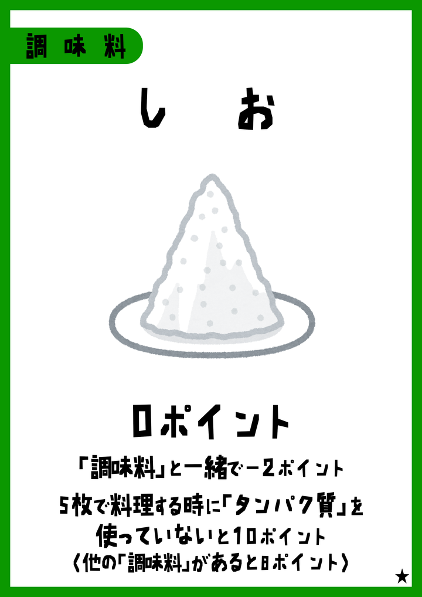 **しお** | 基本 0。他の調味料（しょうゆ・みそ）があると **−2**。タンパク質なしの **5 枚**料理なら **12 点** |
|  **にんにく** | 基本 −2 のうえ、料理の**合計点を 2 倍** |
| 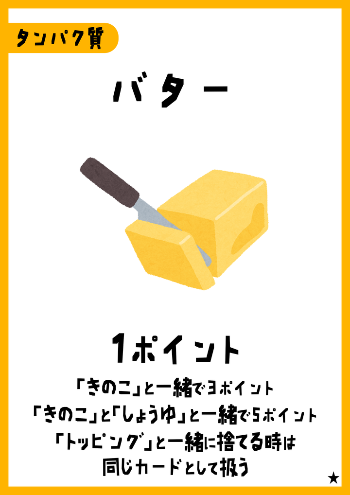 **バター** | **きのこ**で 3、きのこ＋**しょうゆ**で 5 |
|  **ねぎ** | **えび**と一緒ならねぎが 4 点 |
|  **しょうが** | **ぶた**と一緒ならしょうがが 4 点 |
| 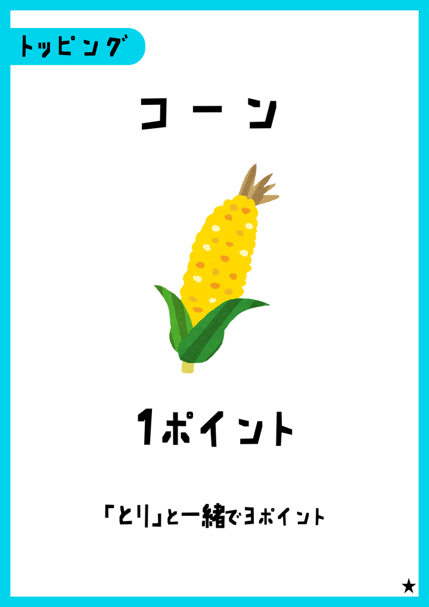 **コーン** | **とり**とで 3 点 |
|  **きのこ** | **とり**とで 3 点 |

ゲーム内の「効果表」でも、カードごとの料理効果・伏せ引き効果を確認できます。

---

## 伏せ引きの「正当なペア」

2 枚ペアで次のいずれなら、味見されても嘘ではありません（3 枚引きできます）。

- 同じ名前のカード 2 枚
- **ごはん** ＋ **めん**
- **たまご** ＋ 調味料（しょうゆ／みそ／しお）1 枚
- **バター** ＋ トッピング 1 枚

1 枚宣言（とり／ぶた／えび）はブラフ可能な代わり、見破られると宣言側はドローできません。

---

## ルールセットの違い

| | **THE NOODLES** | **本家ルール（classic）** |
|--|-----------------|---------------------------|
| デッキ | ★カードあり（ごはん・たまご・バター・みそ・しお・めんま・コーン・もやし・にんにくなど） | ★なし。めん・とり・ぶた・えび・しょうゆ・ねぎ・しょうが・きのこ中心 |
| 味見で嘘を見破ったとき | 味見側が宣言枚数を**すぐ**引く | 味見側は**次ターン +1 ドロー** |
| 必須食材 | めん／ごはん | 実質めん（ごはんはデッキに無い） |

得点計算の式は共通で、classic では使えないカードが出ないだけです。

---

## オフライン得点ツール

印刷カード向けの組み合わせ計算です。

- `noodles.py` — CLI  
- `noodles_gui.py` — GUI（Pillow が必要）

```bash
pip install pillow
python noodles_gui.py
```

---

## ライセンス・クレジット

オマージュ作品です。本家 **stir fly eighteen** のルール・世界観を参考にし、作者・コミュニティへの敬意を込めて制作しています。  
本家のアセットや商標の権利はそれぞれの権利者に帰属します。  
カード画像・ルール画像は本リポジトリ付属のものを利用してください。
